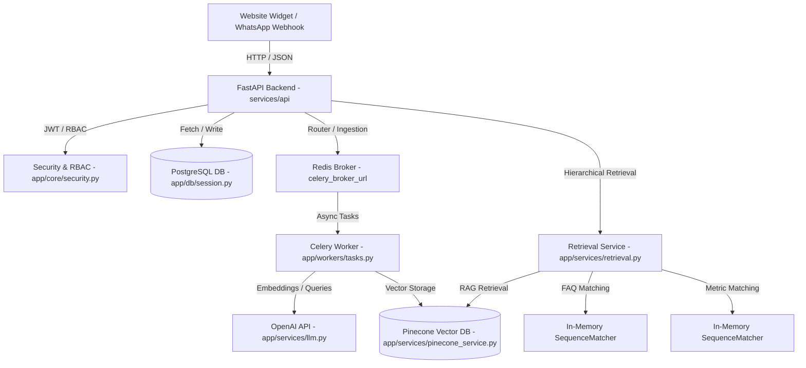

# CIET AI Assistant — Comprehensive Project Audit & Production Readiness Report

**Project Name**: CIET AI Assistant  
**Auditor Profile**: Senior Staff Engineer, Solution Architect, Security Engineer, UI/UX Reviewer, DevOps Engineer, and AI Systems Auditor  
**Date**: July 11, 2026  

---

## 1. Executive Summary

The **CIET AI Assistant** is a multi-channel AI platform designed to serve as an official college virtual assistant across the web widget and WhatsApp. Based on a deep-dive audit of the existing codebase, the project has a well-designed modular foundation. Key features such as multi-channel routing, Shadow DOM isolation for the web widget, role-based access control (RBAC), and basic security guardrails are successfully implemented.

However, the codebase currently exhibits **critical bugs, architectural shortcuts, and security gaps** that prevent it from being production-ready. These include an `UnboundLocalError` that crashes the WhatsApp webhook, a total bypass of safety guardrails for Telugu/Hindi queries, a vector leak during document reprocessing, fake streaming mechanisms on both backend and frontend, and a highly incomplete administrative frontend that lacks delete, edit, or reprocessing buttons.

Currently, the project is graded as **65/100 (Beta Quality / Not Production-Ready)**. Resolving the critical issues highlighted in this report is mandatory before enterprise deployment.

---

## 2. Current Architecture

### Overall System Flow


*   **Frontend Widget (`apps/widget`)**: A React-based SPA bundled into a single file (`ciet-ai.js`) using Vite's library mode. It encapsulates styling in a Shadow DOM host to prevent styling leakage or conflicts with the host website.
*   **Admin Dashboard (`apps/admin`)**: A React SPA that provides database management controls, stats dashboards, and uploads.
*   **Backend API (`services/api`)**: A layered FastAPI application utilizing asynchronous SQLAlchemy models. Runs hierarchical retrieval matching across FAQs, Verified Metrics, and Hybrid RAG.
*   **Background Workers (`app/workers/tasks.py`)**: Celery tasks running on Redis broker instances to decouple resource-intensive PDF/XLSX text extraction, chunking, and embedding from the main FastAPI server.

---

## 3. Critical Issues

### CRIT-01: WhatsApp Webhook `UnboundLocalError` Crash
*   **File Path**: [whatsapp.py](file:///home/saishaidashaik/Documents/projects/CIET_BOT/services/api/app/api/routes/whatsapp.py#L53-L76)
*   **Problem**: In the `/webhook` POST handler, the variable `value` is initialized at line 54 inside the loop `for change in entry.get("changes", [])`. However, the loop `for status in value.get("statuses", [])` at line 76 is indented 12 spaces, placing it *outside* the `for change` loop scope. If a request payload is received without any `changes` entries (e.g., standard WhatsApp verification/status messages), `value` remains unassigned.
*   **Impact**: When a status payload or empty event is received, the backend throws an `UnboundLocalError: local variable 'value' referenced before assignment`, crashing the request handler and resulting in a HTTP 500 error returned to Meta. This can lead to Meta blocking or disabling the webhook.
*   **Recommended Fix**: Adjust the indentation of line 76 to 16 spaces to place it inside the `for change` loop, or initialize `value = {}` at the start of the `for entry` loop.
```python
        for entry in entries:
            for change in entry.get("changes", []):
                value = change.get("value", {})
                for message in value.get("messages", []):
                    # ... processing messages
                for status in value.get("statuses", []):  # Indent to 16 spaces
                    # ... processing statuses
```

### CRIT-02: Multilingual Guardrail Bypass (Telugu & Hindi)
*   **File Path**: [guardrails.py](file:///home/saishaidashaik/Documents/projects/CIET_BOT/services/api/app/services/guardrails.py#L3-L37)
*   **Problem**: The regex matching list `SENSITIVE_PATTERNS` contains only English terms (e.g., `placement percentage`, `fee structure`, `highest package`). The function `contains_unsafe_numeric_claim` similarly filters only English terms (`placement`, `fee`, `package`, `student`, `faculty`). 
*   **Impact**: If a user switches the widget to Telugu or Hindi and asks a sensitive question in native characters (e.g., "ఫీజు ఎంత?" or "प्लेसमेंट क्या है?"), `is_sensitive_stat_question` returns `False`, and `contains_unsafe_numeric_claim` returns `False`. The guardrails are bypassed entirely, enabling the assistant to hallucinate and fabricate placement statistics, fees, and administrative details without intervention.
*   **Recommended Fix**: Translate the guardrail keywords to Telugu and Hindi, or implement language-agnostic detection by checking for numbers and currency symbols (e.g. `\u20b9`, `LPA`, `%`) whenever the query topic matches high-risk categories, regardless of language.

### CRIT-03: Vector Leak & RAG Poisoning during Reprocessing
*   **File Path**: [tasks.py](file:///home/saishaidashaik/Documents/projects/CIET_BOT/services/api/app/workers/tasks.py#L33-L49)
*   **Problem**: When re-processing an uploaded document via the Celery background task `_process_document`, the database chunks are deleted using SQL: `await session.execute(DocumentChunk.__table__.delete().where(DocumentChunk.document_id == document_id))`. However, the corresponding vector embeddings in Pinecone are **never deleted**.
*   **Impact**: Old embeddings remain orphaned inside the Pinecone vector index. During subsequent hybrid searches, Pinecone will return these matches, but the backend will fail to join them against Postgres chunks or map them to incorrect, old chunk IDs. This poisons RAG results and degrades similarity search accuracy.
*   **Recommended Fix**: Call `PineconeService(settings).delete_document(document_id)` inside `_process_document` before executing the database chunk deletion.

---

## 4. High Priority Issues

### HIGH-01: Publicly Exposed Bootstrap Endpoint
*   **File Path**: [auth.py](file:///home/saishaidashaik/Documents/projects/CIET_BOT/services/api/app/api/routes/auth.py#L28-L47)
*   **Problem**: The `/auth/bootstrap` route allows any caller to create the initial `super_admin` user. While it checks if *any* admin user exists first, there are no environment flags (e.g., rejecting in staging/production) or authentication key checks.
*   **Impact**: If all admin users are deleted (intentionally or due to a database reset/migration), the endpoint becomes active. An external attacker could scan this endpoint, bootstrap themselves as a `super_admin`, and take over the admin panel.
*   **Recommended Fix**: Guard the endpoint using an environment flag or restrict it to `local` mode:
```python
    if settings.environment == "production":
        raise HTTPException(status_code=403, detail="Bootstrap disabled in production")
```

### HIGH-02: Missing Document Persistence (R2 Offline Fallback)
*   **File Path**: [storage.py](file:///home/saishaidashaik/Documents/projects/CIET_BOT/services/api/app/services/storage.py#L18-L27)
*   **Problem**: If Cloudflare R2 environment variables are not set, `StorageService.put` returns a dummy path `local://{key}` without actually writing the binary contents to disk.
*   **Impact**: Uploaded files are entirely lost when R2 is offline or not configured (e.g., local development or docker deployments without R2). Admins cannot retrieve, review, or audit files later, and re-processing documents becomes impossible since the file contents are missing.
*   **Recommended Fix**: Implement a local file storage fallback that writes content to a persistent folder (e.g. `/app/storage/uploads`) in the workspace, mounted via Docker volumes.

### HIGH-03: Reprocess Endpoint fails to Queue Celery Task
*   **File Path**: [admin.py](file:///home/saishaidashaik/Documents/projects/CIET_BOT/services/api/app/api/routes/admin.py#L266-L287)
*   **Problem**: The `/documents/{document_id}/reprocess` POST endpoint updates the document and job statuses in the database to `"queued"`, but it never invokes the Celery task `process_document.delay()`.
*   **Impact**: Reprocessing a document via the API updates the status in the UI but does nothing in the background. The job remains stuck in `queued` state forever.
*   **Recommended Fix**: Trigger the task at the end of the endpoint logic:
```python
    process_document.delay(document.id, base64.b64encode(content).decode("ascii"), document.title)
```
*(Note: Requires fetching the document content from storage first, which highlights the importance of fixing HIGH-02).*

---

## 5. Medium Priority Issues

### MED-01: In-Memory Database Loading & CPU Bottleneck
*   **File Path**: [retrieval.py](file:///home/saishaidashaik/Documents/projects/CIET_BOT/services/api/app/services/retrieval.py#L44-L94)
*   **Problem**: `_faq` and `_metric` fetch *all* FAQs and *all* metrics from the database (via `select(FAQ)` and `select(Metric)`) and compare them against the user query in memory using `SequenceMatcher`.
*   **Impact**: If the FAQ or Metric count grows (e.g. >1000 items), this CPU-bound matching will block the FastAPI async event loop, causing severe latency and request timeouts.
*   **Recommended Fix**: Migrate FAQ matching to PostgreSQL full-text search or vector similarity search in Pinecone, and query only the top matches.

### MED-02: Missing window.CIETAI Global Controller
*   **File Path**: [embed.tsx](file:///home/saishaidashaik/Documents/projects/CIET_BOT/apps/widget/src/embed.tsx#L8-L13)
*   **Problem**: The global `window.CIETAI` interface is defined in types but is never initialized or assigned in the code.
*   **Impact**: The host website cannot open or minimize the widget programmatically (e.g. via a custom button in the page header).
*   **Recommended Fix**: Expose a global hook on `window` inside `embed.tsx` that links to the widget mount wrapper.

### MED-03: Blocking Synchronous Pinecone Deletion
*   **File Path**: [admin.py](file:///home/saishaidashaik/Documents/projects/CIET_BOT/services/api/app/api/routes/admin.py#L300), [pinecone_service.py](file:///home/saishaidashaik/Documents/projects/CIET_BOT/services/api/app/services/pinecone_service.py#L52-L58)
*   **Problem**: When deleting a document, the async route handler calls `PineconeService(settings).delete_document(document_id)`, which runs a blocking synchronous Pinecone client call `self.index.delete(...)` under the hood.
*   **Impact**: Blocking synchronous calls in an async thread block the event loop, degrading backend response times.
*   **Recommended Fix**: Run the deletion in an executor thread:
```python
    await asyncio.to_thread(self.index.delete, filter={"document_id": {"$eq": document_id}}, namespace=self.settings.pinecone_namespace)
```

---

## 6. Low Priority Issues

### LOW-01: Lack of Refresh Token Flow
*   **File Path**: [security.py](file:///home/saishaidashaik/Documents/projects/CIET_BOT/services/api/app/core/security.py#L35-L47)
*   **Problem**: Access tokens expire in 30 minutes. No refresh tokens are implemented.
*   **Impact**: Admins are logged out every 30 minutes, leading to an annoying user experience.
*   **Recommended Fix**: Implement standard OAuth2 refresh token flows with longer lifespans.

### LOW-02: Romanized Telugu/Hindi Script Detection Failures
*   **File Path**: [language.py](file:///home/saishaidashaik/Documents/projects/CIET_BOT/services/api/app/services/language.py#L1-L9)
*   **Problem**: The Unicode block heuristic checks character ranges. If a user types Telugu or Hindi in Roman script (e.g. "bus fee entha" or "admissions kab start honge"), it returns `"en"`.
*   **Impact**: The system prompt instructs the LLM in English, which might lead to the LLM responding in English even if the user typed Romanized Telugu.
*   **Recommended Fix**: Incorporate a simple language detection library (e.g. `langdetect`) or fall back to OpenAI language detection.

---

## 7. Missing Features

1.  **Delete/Edit Capabilities in Admin UI**: The backend implements full delete and update endpoints for FAQs, metrics, and documents, but the Admin React UI has no buttons or interfaces to trigger them.
2.  **Pagination and Search in Admin UI**: Admin lists fetch all rows from the database. It lacks search filters and pagination controls in the dashboard tables.
3.  **Real Token Streaming**: While a streaming endpoint exists, the backend pre-computes the entire response synchronously and fake-streams it. The frontend does not implement SSE and waits for the entire payload.
4.  **Metric Localization**: Metrics are stored only in English. There is no Telugu or Hindi translation mapping for metrics in the database or during retrieval.

---

## 8. Production Risks

1.  **Hallucination of Statistics**: Due to the multilingual guardrail bypass, the assistant can fabricate placement statistics, highest packages, average packages, fees, and student counts when asked in Telugu or Hindi.
2.  **Webhook Deactivation**: Uncaught exceptions (`UnboundLocalError`) during WhatsApp webhook execution return HTTP 500. Meta frequently deactivates webhooks that exhibit high error rates.
3.  **Denial of Service (DoS)**: Lack of rate limiting on the WhatsApp webhook enables callers to spam the API, exhausting the OpenAI budget or locking the database.

---

## 9. Recommended Fixes

### Fix 1: Hardening the Guardrails for Multilingual Support
Update `services/api/app/services/guardrails.py` to check for Telugu/Hindi high-risk words and implement a strict currency/metric pattern scanner that checks the generated output for values whenever the query topic relates to placement, fees, or packages:
```python
# services/api/app/services/guardrails.py

import re

SENSITIVE_PATTERNS = [
    # English
    r"\bplacement\s*percentage\b", r"\bfee\s*(structure|amount|details)?\b", 
    r"\bhighest\s*package\b", r"\baverage\s*package\b", r"\bstudent\s*(count|strength|number)\b",
    # Telugu
    r"ప్లేస్‌మెంట్", r"ఫీజు", r"హాస్టల్ ఫీజు", r"జీతం", r"ప్యాకేజీ",
    # Hindi
    r"प्लेसमेंट", r"फीस", r"छात्रावास शुल्क", r"वेतन", r"पैकेज"
]
```

### Fix 2: Implement Real Asynchronous Vector Deletion in Celery
Update the Celery process document task to clean up old vector entries from Pinecone:
```python
# services/api/app/workers/tasks.py
async def _process_document(document_id: str, content: bytes, filename: str) -> None:
    settings = get_settings()
    async with SessionLocal() as session:
        # ...
        # Clean up old vectors from Pinecone before replacing chunks
        PineconeService(settings).delete_document(document_id)
        await session.execute(DocumentChunk.__table__.delete().where(DocumentChunk.document_id == document_id))
        # ...
```

---

## 10. Deployment Readiness

*   **PostgreSQL**: Migration script works. Highly deployable.
*   **Redis/Celery**: Configured, but Celery lacks custom resource limits (concurrency settings should be adjusted in Docker to avoid OOM).
*   **Pinecone**: Integrates cleanly, but requires async wrapper support.
*   **Cloudflare R2**: Highly recommended. Local storage fallback needs to be resolved for air-gapped deployments.

---

## 11. Final Scorecard

```
┌─────────────────────────────────────────────────────┐
│           CIET AI ASSISTANT — SCORECARD             │
├────────────────────────┬──────────┬─────────────────┤
│ Dimension              │ Score    │ Grade           │
├────────────────────────┼──────────┼─────────────────┤
│ Architecture           │ 70/100   │ C (No Stream)   │
│ Code Quality           │ 68/100   │ D (Sync Block)  │
│ Security               │ 60/100   │ D (Multilingual)│
│ Test Coverage          │ 55/100   │ F (No RBAC/UI)  │
│ Frontend UX/DX         │ 65/100   │ D (Admin Gaps)  │
│ Scalability            │ 60/100   │ D (In-Memory)   │
│ DevOps / CI-CD         │ 80/100   │ B (Docker Ok)   │
│ Documentation          │ 90/100   │ A               │
├────────────────────────┼──────────┼─────────────────┤
│ OVERALL SCORE          │ 65/100   │ C- (Beta)       │
└────────────────────────┴──────────┴─────────────────┘
```

---

## 12. Top 20 Actions Required Before Production

1.  **Fix Indentation** of statuses in `whatsapp.py` to prevent `UnboundLocalError`.
2.  **Translate Guardrails** in `guardrails.py` to support Hindi and Telugu pattern checks.
3.  **Add Vector Cleanups** to Celery task in `tasks.py` during document reprocessing.
4.  **Secure Bootstrap Endpoint** in `auth.py` by blocking it when `ENVIRONMENT=production`.
5.  **Expose Delete buttons** for FAQs, Metrics, and Documents in the React admin dashboard.
6.  **Expose Edit buttons** for FAQs and Metrics in the React admin dashboard.
7.  **Add Pagination** to the FAQs, Metrics, and Documents tables in the React admin dashboard.
8.  **Expose Reprocess button** for documents in the React admin dashboard.
9.  **Trigger Celery Task** in the `/reprocess` API endpoint in `admin.py`.
10. **Implement Thread Executor** for Pinecone's synchronous `delete_document` in `pinecone_service.py` to prevent thread blocking.
11. **Refactor In-Memory Search** for FAQs/Metrics to database-indexed lookups or vector matching to avoid $O(N)$ CPU locks.
12. **Implement Local File Persistence** inside `StorageService` when R2 is disabled.
13. **Expose window.CIETAI.open()** in `embed.tsx` for custom host web integrations.
14. **Fix Thread Grouping** in the Admin Logs table so messages are sorted by conversation instead of a flat dump.
15. **Add Authentication Integration Tests** for RBAC, JWT tokens, and endpoint permissions.
16. **Add E2E Playwright Tests** to cover the widget embed loader and admin flows.
17. **Integrate Real OpenAI Streaming** using Server-Sent Events (SSE) instead of the current fake word-split loop.
18. **Expose Feedback Dashboard** rows in the Admin dashboard using a dedicated DB query.
19. **Reduce Widget Bundle Size** by dynamic imports, removing unused icons, and lazy-loading `framer-motion`.
20. **Implement WhatsApp Rate Limiting** to prevent brute-force cost exhaustion.
